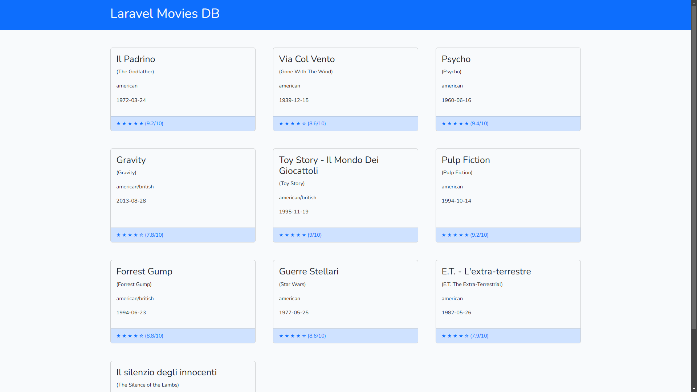

# Descrizione
- Nome repo: laravel-model-controller
Oggi facciamo la nostra prima vera interazione con il database utilizzando Eloquent, l’ORM di Laravel!

## Svolgimento
- Create un nuovo progetto Laravel
- tramite phpMyAdmin o MySQL Workbench create un nuovo database laravel_model_controller
- Importate nel vostro database la tabella movies in allegato
- inserite le vostre credenziali per il database nel file .env
- Create un model Movie.php col comando 

php artisan make:model Movie
- Create un controller che gestirà la rotta / col comando

php artisan make:controller Guest/PageController
- All’interno della funzione index() del controller, recuperate tutti i film dal database e passateli alla view, che quindi li visualizzerà a schermo, tramite delle card.

## Bonus 
Inventare una grafica a piacere per il sito e realizzarne il layout, aggiungendo lo stile con SASS.

# Risultato
